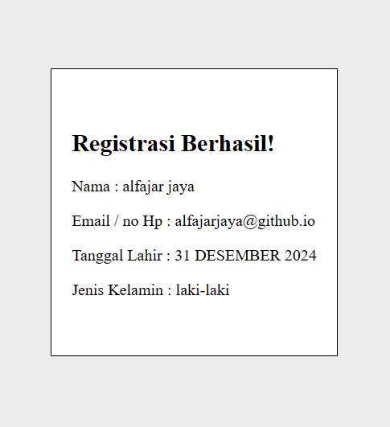

# Project python web flask

## Tugas bahasa pemograman Python yang membuat tampilan halaman login, dan apabila di tekan daftar, maka akan muncul apa saja yang di isi di halaman input sebelumnya

### Silahkan di download apabila diperlukan hehe...
